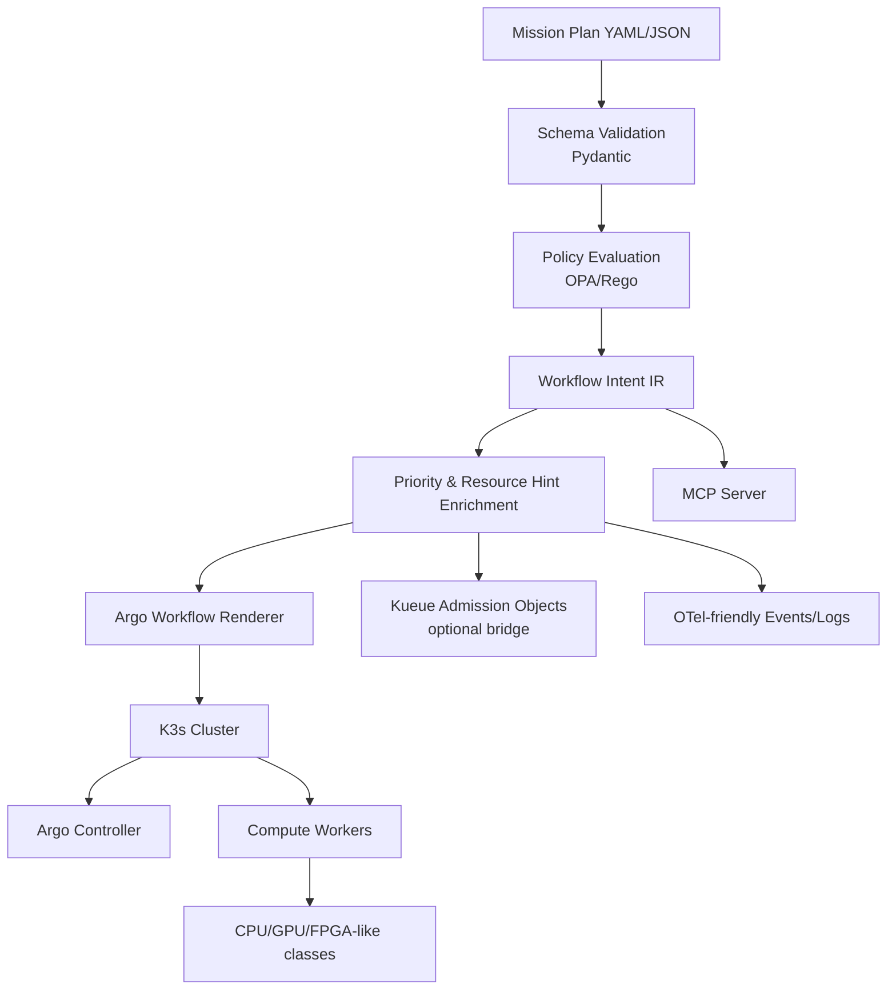

# 04_architecture

## Recommended system
A **Mission Plan Compiler + Policy Guard + Admission Bridge + Workflow Renderer**.

## Core modules
1. **mission schema** — parse and validate structured plans.
2. **policy pack** — reject unsafe or malformed plans before workflow emission.
3. **compiler** — translate mission semantics into workflow intent.
4. **renderer** — emit Argo-compatible manifests.
5. **admission bridge** — optional Kueue-facing objects for quota / preemption semantics.
6. **agent interface** — CLI + MCP.
7. **eval harness** — golden tests for deterministic translation.

## Why this architecture
It directly targets the strongest gap visible in the transcript:
the speakers explain the stack and mention a mission-plan-to-workflow translation layer, but do not publish its semantics. This repo makes that layer explicit and testable.

## Non-goals
- flight software
- actual onboard hardware drivers
- full accelerator brokering
- full storage subsystem
- constellation networking implementation
