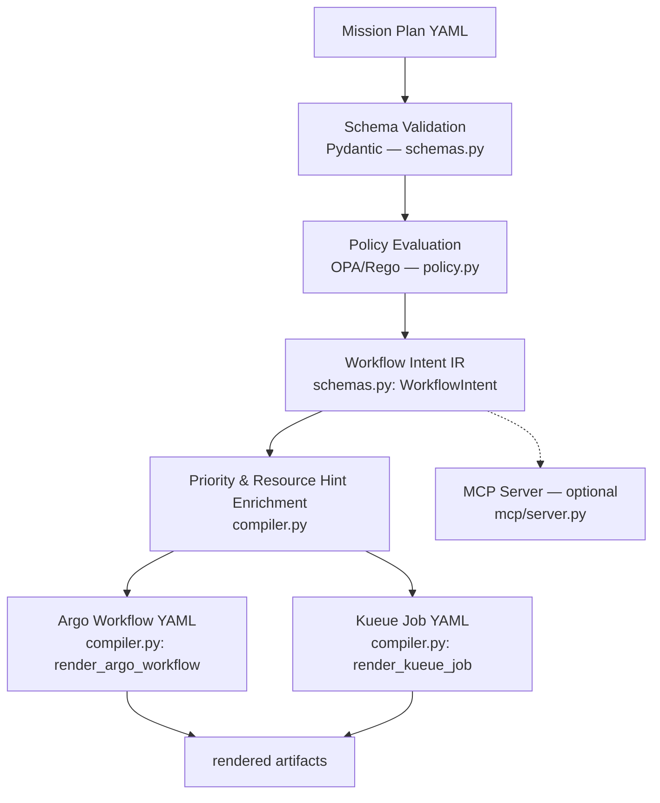

# 04_architecture

## Recommended system
A **Mission Plan Compiler + Policy Guard + Admission Bridge + Workflow Renderer**.



Note: this repo produces **rendered YAML artifacts**. It does not deploy to or control a live cluster. Deployment to an onboard orchestrator (ORCHIDE) is out of scope.

## Source file → ORCHIDE slide mapping

| Source file | ORCHIDE concept | Slide / D3.1 ref | Notes |
|---|---|---|---|
| `schemas.py`: `MissionPlan`, `MissionEvent` | Structured mission plan | Slide 9 (plan table) | Fields: timestamp (timezone-aware RFC3339), orbit, duration_seconds, instrument, event_type, ground_visibility |
| `schemas.py`: `AIService` | AI Service (per-detector workflow) | Slide 9 (WORKFLOW_D1-D4), slide 10 | service_id, priority, landscape_type, steps |
| `schemas.py`: `StepPhase` | Pre / AI / Post phase annotation | Slide 10 (pipeline) | Enum: preprocessing, ai, postprocessing |
| `schemas.py`: `ExecutionMode` | Sequential or parallel execution | Slide 10 ("sequential or in parallel") | Enum: sequential, parallel |
| `schemas.py`: `WorkflowStep` | Processing step with phase | Slide 10 (pipeline) | resource_class, fallback, needs_acceleration, phase |
| `schemas.py`: `ResourceClass` | Hardware resource classes | Slide 14 (CPU/GPU/FPGA) | Enum: cpu, gpu, fpga |
| `schemas.py`: `WorkflowIntent` | Translation output (IR) | Slide 23 (Custom Translation Layer output) | Serves as the IR consumed by both Argo and Kueue renderers |
| `compiler.py`: `load_mission_plan` | Mission plan ingestion | D3.1 §3.2.1.1 (Mission Manager receives plan) | Ground-side equivalent |
| `compiler.py`: `compile_plan_to_intents` | Custom Translation Layer | Slide 23 (Priority Queue → Translation → API-wrapper) | Filters ACQ events, builds WorkflowIntent |
| `compiler.py`: `analyze_timeline_conflicts` | Timeline safety check | — | Shared overlap detector used by compiler and MCP |
| `compiler.py`: `render_argo_workflow` | API-wrapper → Argo Workflows API | Slide 23 (right side of translation layer) | Produces Argo Workflow YAML |
| `compiler.py`: `render_kueue_job` | — (not in ORCHIDE) | — | Ground-side addition: Kueue admission semantics |
| `policy.py` + `configs/policies/*.rego` | — (not in ORCHIDE) | — | Ground-side addition: 10 deny rules, OPA/Rego |
| `cli.py` | — (not in ORCHIDE) | — | Ground-side CLI: compile, render-argo, render-kueue, inspect, policy |
| `mcp/server.py` | — (not in ORCHIDE) | — | Optional: 6 MCP tools for AI agents |
| `eval_runner.py` + `evals/golden/` | — (not in ORCHIDE) | — | Ground-side: golden translation tests |

## Validation layering

Schema validation (Pydantic) and policy validation (OPA/Rego) intentionally overlap on some rules for defense-in-depth:

| Constraint | Schema (schemas.py) | Policy (mission_plan.rego) |
|---|---|---|
| timestamp must be parseable + timezone-aware | `MissionEvent.timestamp: AwareDatetime` | — |
| ACQ must have instrument | `model_validator` raises ValueError | — |
| DOWNLOAD must not have services | `model_validator` raises ValueError | Rule 7 denies |
| DOWNLOAD must have visibility | `model_validator` raises ValueError | Rule 8 denies |
| mission_id must not be missing/null/blank | `field_validator` rejects blank via `strip()` check (no normalization) | Rule 1 denies missing/null and trims with `trim_space` |
| Priority must not be 0 | `Field(ge=0)` allows it | Rule 5 denies it |
| GPU+acceleration needs fallback | — | Rule 4 denies |
| CPU+acceleration is contradictory | — | Rule 6 denies |
| Service needs ≥1 step | `Field(min_length=1)` | Rule 9 denies |
| Invalid landscape_type | — | Rule 10 denies |

Design intent: schema catches structural errors at parse time. Policy catches semantic errors that require cross-field reasoning. Where both layers enforce the same rule, the earlier layer (schema) prevents bad data from entering the pipeline, and the later layer (policy) catches data that bypasses schema validation (e.g., raw JSON sent directly to OPA).

## Relationship to ORCHIDE

```
Ground (this repo)                    Onboard (ORCHIDE)
─────────────────                     ─────────────────
Mission Plan YAML                     
  → Schema Validation (Pydantic)      
  → Policy Guard (OPA/Rego)           ← not in ORCHIDE
  → Workflow Intent IR                
  → Argo Workflow YAML                
  → Kueue Job YAML                    ← not in ORCHIDE
  → MCP Tools (optional)              ← not in ORCHIDE
        │                             
        ▼ deploy via IF SO_MIS_DP     
                                      Mission Manager receives plan
                                        → Scheduler → Workflow Manager
                                        → Argo → K3S → urunc/ukAccel
```

## ORCHIDE platform services (contracts only — not implemented here)

These components exist in ORCHIDE's orchestrator node (slide 20) and are candidates for interface contracts in Phase 5:

| ORCHIDE component | Slide | D3.1 section | Contract status |
|---|---|---|---|
| Storage Manager (Zot + EOS) | 20, 22 | §3.2.1.2 | `contracts/storage.py` — contract only |
| Monitor Manager (Vector + API) | 20, 24 | §3.2.1.5 | `contracts/monitor.py` — contract only |
| Communication Manager | 20 | §3.2.1.1.3 | `contracts/communication.py` — contract only |
| Security Manager | 20 | §3.2.1.4 | `contracts/security.py` — contract only |
| Simulation Framework | 7 | §2.4.1.2 | `contracts/simulation.py` — contract only |
| SDK / Application Builder | 7 | §2.4.1.1, §5.1 | `contracts/packaging.py` — contract only (on PR #15) |

## Non-goals
- Flight software or onboard runtime
- Actual onboard hardware drivers or ukAccel integration
- Full accelerator brokering
- Full storage subsystem (EOS/Zot)
- Full monitoring stack (Vector/OpenSearch/Prometheus)
- Constellation networking
- Full developer platform or SDK
