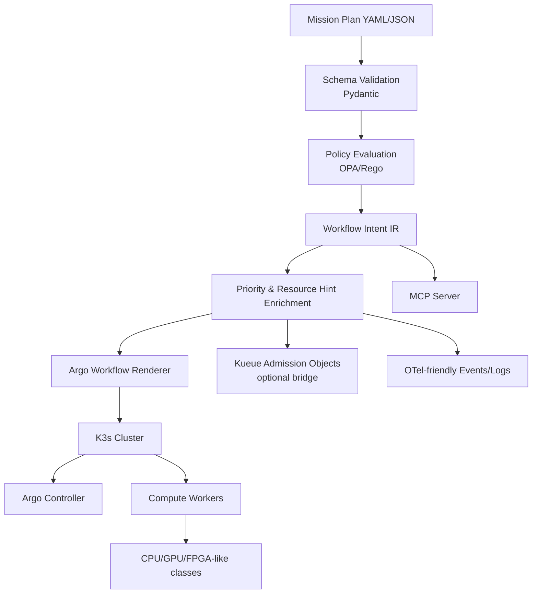

# 04_architecture

## Recommended system
A **Mission Plan Compiler + Policy Guard + Admission Bridge + Workflow Renderer**.



## Core modules
1. **mission schema** (`schemas.py`) — parse and validate structured plans. Aligned with ORCHIDE slide 9: supports orbit, duration_seconds, per-service landscape_type, in addition to event_type, timestamp, instrument, ground_visibility, priority.
2. **policy pack** (`policy.py` + `configs/policies/`) — reject unsafe or malformed plans before workflow emission.
3. **compiler** (`compiler.py`) — translate mission semantics into workflow intent IR.
4. **renderer** (`compiler.py`: `render_argo_workflow`, `render_kueue_job`) — emit Argo and Kueue manifests.
5. **agent interface** (`cli.py` + `mcp/server.py`) — CLI + MCP (optional, serves the mainline).
6. **eval harness** (`eval_runner.py` + `evals/golden/`) — golden tests for deterministic translation.

## Why this architecture
ORCHIDE implements an onboard "translation from Mission Plan to Argo workflow" (KubeCon EU 2026, slide 23) as embedded glue code inside its Mission Manager. However, ORCHIDE's D3.1 explicitly excludes mission plan generation, validation, and compilation from its scope. This repo fills that gap by making the ground-side compilation layer explicit, testable, and policy-aware.

## Relationship to ORCHIDE
```
Ground (this repo)                    Onboard (ORCHIDE)
─────────────────                     ─────────────────
Mission Plan YAML                     
  → Schema Validation (Pydantic)      
  → Policy Guard (OPA/Rego)           ← not in ORCHIDE
  → Argo Workflow Renderer            
  → Kueue Job Renderer                ← not in ORCHIDE
  → MCP Tools                         ← not in ORCHIDE
        │                             
        ▼ deploy via IF SO_MIS_DP     
                                      Mission Manager receives plan
                                        → Scheduler → Workflow Manager
                                        → Argo → K3S → urunc/ukAccel
```

## Non-goals
- flight software
- actual onboard hardware drivers
- full accelerator brokering
- full storage subsystem
- constellation networking implementation
